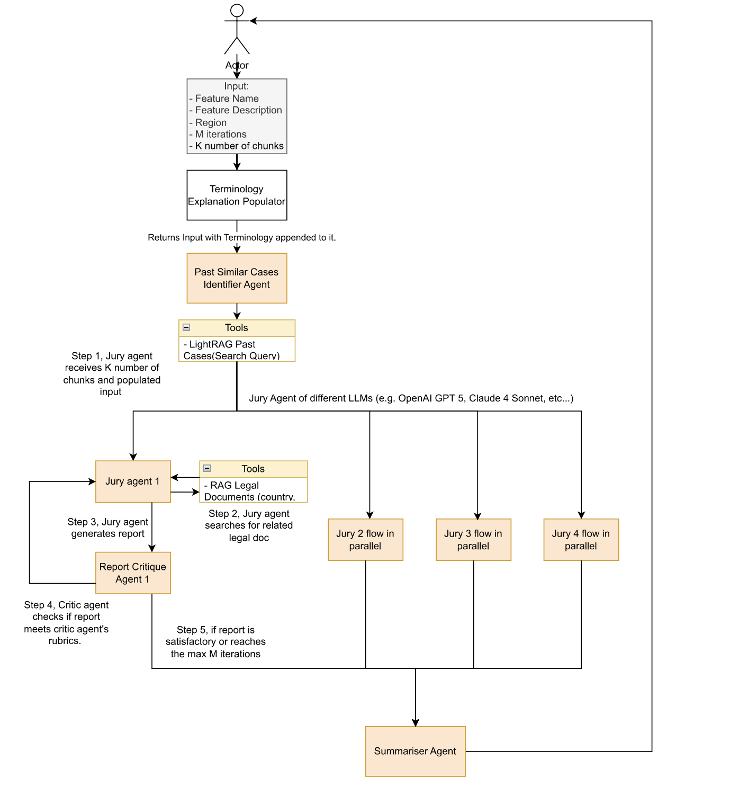

# ⚖️ JurAI – Automating Geo-Regulation with LLMs

## 🌍 The Challenge  
Building products for a global audience is tricky. Every new feature might be perfectly fine in one place but raise red flags elsewhere. Think California SB-976, the EU DSA, GDPR, the list keeps growing.  

Today, compliance checks are:  
- **Slow and costly** — lawyers comb through every feature  
- **Inconsistent** — different reviewers → different verdicts  
- **Risky** — laws evolve quickly, so things get missed  

We wanted a way to **catch geo-regulation issues early** — with evidence that’s clear, auditable, and fast enough to keep up with product cycles.  

---

## 🚀 Our Approach 

We built **JurAI**, a multi-agent AI pipeline that works like a courtroom for compliance.  
Given a feature description and a target region, JurAI delivers a **JSON compliance report** that spells out:  
- Whether region-specific compliance is required  
- Which clauses and laws apply  
- Why the decision was made (with sources you can trace)  

Instead of guesswork, you get an **auditable verdict** you can plug directly into legal review or CI/CD.  

---

## ✨ How It Works  

**1. Dual Retrieval**  
- *Past Verdicts*: broad coverage using vector similarity  
- *Legislation*: precise matches using entity-based search  

**2. Jury & Critic System**  
- Multiple **Jury Agents** analyze the feature independently  
- Each Jury has its own **Critic Agent** that reviews, points out weaknesses, and forces revisions  
- A **Judge Agent** merges jury outputs, removes duplicates, and delivers one clean verdict  

**3. Diversity of Models**  
- Juries don’t all run on the same LLM — e.g., one might use DeepSeek, another GPT-5-mini  
- Critics and Judge can mix models too  
- This way, no single model’s blind spots dominate the outcome  

**4. Structured, Human-Friendly Output**  
- Always JSON, never free-text rambling  
- Every statement backed by a citation  
- Easy for lawyers *and* pipelines to parse  

---

## 🧠 Why This Matters  
- ⚡ **Faster reviews** — first-pass compliance in minutes, not weeks  
- 🔍 **Transparent** — every verdict comes with references  
- 🧩 **Modular** — drop in new laws/regions as needed  
- 🧠 **Robust** — multiple models + self-critics → fewer blind spots  
- 💡 **Engaging** — it feels like watching AI lawyers argue and a judge decide  

---

## 📂 Repo Structure  
```
.
├── frontend/ # Next.js UI (feature input + report display)
├── backend/ # Google ADK agents (Jury, Critics, Judge, RAG tools)
└── README.md # This file
```

Each subfolder has its own README with setup instructions.  

---

## 🚦 What’s Next  
- Expand to more regions (APAC, LATAM, etc.)  
- Benchmark against human lawyer reviews  
- Batch processing for cheaper API calls  
- Feedback loop so users can refine verdicts   
- Let users pick which LLMs power their juries/critics  

---

**JurAI turns compliance from a bottleneck into a traceable, auditable, and scalable part of the dev cycle.**
